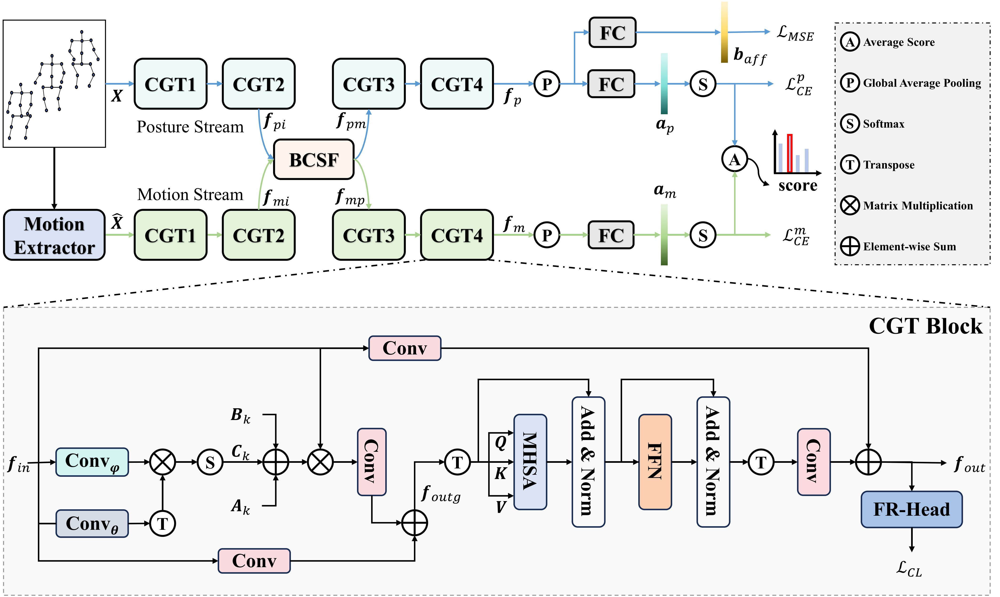

<div align="center">

# CGTGait: Collaborative Graph and Transformer for Gait Emotion Recognition [IJCB 2025 Oral]


<i>Junjie Zhou, Haijun Xiong, Junhao Lu, Ziyu Lin, Bin Feng</i>

[](https://ieeexplore.ieee.org/abstract/document/11411435)

</div>

Official Implementation of CGTGait: Collaborative Graph and Transformer for Gait Emotion Recognition. [Paper](https://arxiv.org/abs/2509.16623).

## Publication
>**CGTGait: Collaborative Graph and Transformer for Gait Emotion Recognition**<br>
Junjie Zhou, Haijun Xiong, Junhao Lu, Ziyu Lin, Bin Feng<br>
<i>IEEE International Joint Conference onBiometrics (IJCB)</i>.</br>


## Abstract
Skeleton-based gait emotion recognition has received significant attention due to its wide-ranging applications. However, existing methods primarily focus on extracting spatial and local temporal motion information, failing to capture long-range temporal representations. In this paper, we propose \textbf{CGTGait}, a novel framework that collaboratively integrates graph convolution and transformers to extract discriminative spatiotemporal features for gait emotion recognition. Specifically, CGTGait consists of multiple CGT blocks, where each block employs graph convolution to capture frame-level spatial topology and the transformer to model global temporal dependencies. Additionally, we introduce a Bidirectional Cross-Stream Fusion (BCSF) module to effectively aggregate posture and motion spatiotemporal features, facilitating the exchange of complementary information between the two streams. We evaluate our method on two widely used datasets, Emotion-Gait and ELMD, demonstrating that our CGTGait achieves state-of-the-art or at least competitive performance while reducing computational complexity by approximately \textbf{82.2\%} (only requiring 0.34G FLOPs) during testing.

<p align="center">
  
</p>

## Running
### Installation
1. Clone repository
```
git clone https://github.com/githubzjj1/CGTGait.git
```
2.  Create an Anaconda environment and install the dependencies
```
conda env create -f environment.yml
conda activate CGTGait
```
### Dataset
Please refer to [BPM-GCN](https://github.com/exped1230/BPM-GCN)

### Training
```
python main.py --config ./config/EGait_journal/train_Emotion-Gait.yaml
```

## Citation
If you find this repo useful in your project or research, please consider citing the relevant publication.
**Bibtex Citation**
````
@inproceedings{zhou2025cgtgait,
  title={Cgtgait: Collaborative graph and transformer for gait emotion recognition},
  author={Zhou, Junjie and Xiong, Haijun and Lu, Junhao and Lin, Ziyu and Feng, Bin},
  booktitle={2025 IEEE International Joint Conference on Biometrics (IJCB)},
  pages={1--11},
  year={2025},
  organization={IEEE}
}
````

